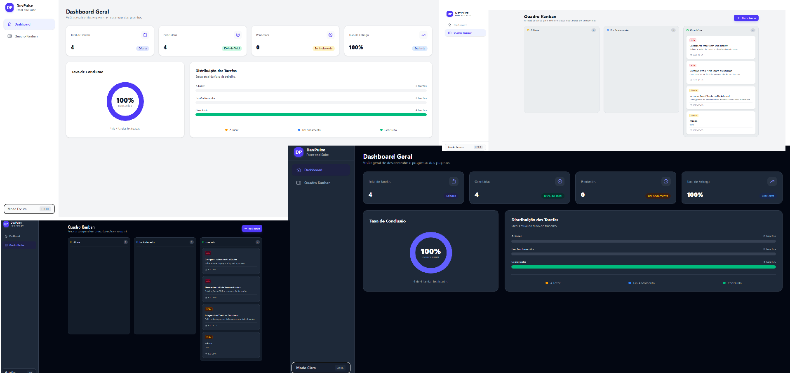

# 🚀 DevPulse — Dashboard & Kanban System

> Uma aplicação web moderna e responsiva para gerenciamento de projetos e visualização de métricas de produtividade em tempo real.


---

## 💻 Sobre o Projeto

O **DevPulse** é um dashboard interativo integrado a um quadro Kanban com sistema de **Drag and Drop** nativo. Desenvolvido para simular uma aplicação SaaS real, a plataforma oferece uma experiência de usuário fluida com suporte nativo a temas (Light/Dark Mode) e persistência de dados.

### ✨ Principais Funcionalidades

- **📊 Dashboard Analítica:** Métricas em tempo real (KPIs de desempenho, taxa de conclusão e gráficos dinâmicos via SVG responsivo).
- **📋 Quadro Kanban Funcional:**
  - Arraste e solte tarefas (*Drag and Drop*) entre colunas.
  - CRUD completo de tarefas (Criar, Editar, Mover e Excluir).
  - Categorização por prioridades (Baixa, Média, Alta) e prazos de entrega.
- **🎨 Dark / Light Mode:** Alternância dinâmica de tema com persistência das preferências do usuário.
- **💾 Persistência Reativa:** Sincronização automática do estado das tarefas e tema utilizando `localStorage` através do **Pinia**.
- **⚡ Layout Responsivo:** Design adaptável otimizado com a versão mais recente do **Tailwind CSS v4**.

---

## 🛠️ Tecnologias Utilizadas

- **Core:** [Vue 3](https://vuejs.org/) (Composition API + `<script setup>`)
- **Build Tool:** [Vite](https://vitejs.dev/)
- **Gerenciamento de Estado:** [Pinia](https://pinia.vuejs.org/)
- **Roteamento:** [Vue Router](https://router.vuejs.org/)
- **Estilização:** [Tailwind CSS v4](https://tailwindcss.com/)
- **Ícones:** Heroicons (SVG)

---

## 📁 Estrutura do Projeto

```text
devpulse-dashboard/
├── src/
│   ├── assets/          # Estilos globais e importações do Tailwind CSS v4
│   ├── components/      # Componentes de layout e navegação reutilizáveis
│   ├── layouts/         # Layouts base da aplicação (AppLayout)
│   ├── router/          # Configuração das rotas SPA e navegação
│   ├── stores/          # Stores do Pinia (Gerenciamento de Tarefas e Tema)
│   ├── views/           # Páginas da aplicação (DashboardView e KanbanView)
│   ├── App.vue          # Componente raiz
│   └── main.ts          # Inicialização da instância do Vue
├── index.html
├── vite.config.js       # Configuração do Vite e plugins do Tailwind
└── package.json


